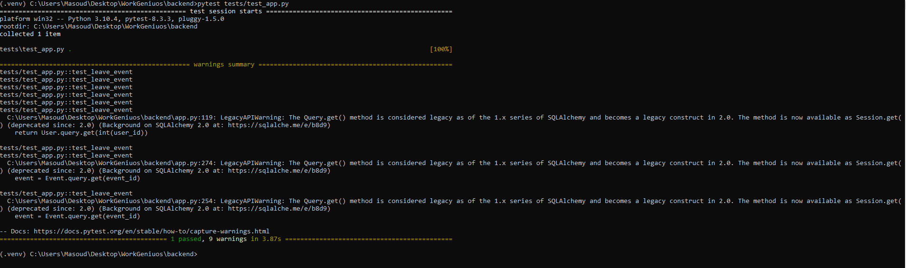

# Event Management App

This is a real-time event management application where users can register as **Organizers** or **Joiners** to create and participate in events. The app is built with **Flask** for the backend, **React** for the frontend, and **Socket.IO** to support real-time updates.

## Features

1. **User Roles**  
   - Users can register and log in with roles of **Organizer** or **Joiner**.
   - **Organizers** can create and delete their own events.
   - **Joiners** can join or leave any available event.

2. **Real-Time Notifications**  
   - Actions like creating, joining, or leaving events are broadcast to all users in real-time using **Socket.IO**, enabling immediate updates across sessions.

3. **Intuitive UI and Real-time Dashboard**  
   - **Organizers** have a dedicated panel to manage their events.
   - **Joiners** have a dashboard to see all events and join or leave as desired.

4. **Automated Testing and Planned CI/CD**  
   - Tests cover core functionalities like event creation and joining, with plans for full CI/CD automation.

## Screenshots

1. **Login Page**  
   

2. **Organizer Panel**  
   

3. **Joiner Panel**  
   

4. **Command Line - Tests Passing**  
   

## Development Process

### Step 1: Database Design

- **Users Table**:
  - `user_id`: Unique identifier for each user.
  - `name`: User’s display name.
  - `role`: Defines the user as either an Organizer or Joiner.
  - `password_hash`: Stores a hashed password for secure authentication.

- **Events Table**:
  - `event_id`: Unique identifier for each event.
  - `event_title`: Title or name of the event.
  - `organizer_id`: Foreign key referencing the Organizer who created the event.
  - `date_time`: The scheduled date and time for the event.
  - `duration`: Duration of the event.
  - `location`: Event location details.
  - **Joiners**: Many-to-many relationship with `Users`, allowing multiple users to join a single event.

- **Event_Joiners Table**:
  - This table manages relationships between events and users who joined, with `event_id` and `user_id` to track which users joined which events.

### Step 2: Backend Development

- **ORM and Models**:
  - Defined `User` and `Event` classes to represent users and events, mapped to the database tables using **SQLAlchemy**.
  - Set up relationships and CRUD methods to manage database interactions easily.

- **API Endpoints**:
  - Created endpoints for all key features using Flask’s `@app.route` decorator:
    - User registration and login
    - Event creation, listing, and deletion
    - Join/leave actions for Joiners

- **Real-time Event Handling**:
  - Implemented real-time updates with **Socket.IO**, which emits event changes to all active users without refreshing the page.

### Step 3: Frontend Development

- Developed using **React**, with real-time event updates powered by **Socket.IO** for instant, seamless interaction.

### Step 4: Testing

- Wrote automated tests covering major functionalities:
  1. **Organizer registration** and login.
  2. **Event creation** by the Organizer.
  3. **Logout** for the Organizer.
  4. **Joiner registration** and login.
  5. **Joining an event** by the Joiner.
  6. **Leaving the event** by the Joiner.
  
- All tests passed successfully, verifying stability in key features.

### Step 5: Dockerization (In Progress)

- Dockerized the backend, frontend, and database for easy deployment in any environment.
- Used **Docker Compose** to integrate all components. Encountered minor database connection issues, which are being resolved for smoother deployment.
- Future plans include finalizing Docker setup and integrating **GitLab CI/CD** for automated testing and deployment.

## Challenges and Future Plans

1. **Dockerization**:
   - Resolve backend-database connection issues in Docker and ensure compatibility across various environments.

2. **CI/CD Pipeline**:
   - Plan to implement GitLab CI/CD to automate the testing and deployment pipeline.

3. **K3s Deployment**:
   - Deploy the application on a local Kubernetes (K3s) setup for production-grade scalability.


## Getting Started

### Prerequisites

- Install [Python](https://www.python.org/downloads/) and [pip](https://pip.pypa.io/en/stable/installation/) for backend dependencies.
- Install [Node.js and npm](https://nodejs.org/en/download/) for frontend dependencies.

### Installation

1. Clone the repository:
   ```bash
   git clone https://github.com/your-username/event-management-app.git

2. Create a virtual environment for the backend:
   ```python
   python -m venv venv

3. Activate the virtual environment:
   ```bash
   venv\Scripts\activate

4. Navigate to the backend directory and install the dependencies:
   ```python
   pip install -r requirements.txt

5. Initialize and upgrade the database:
   ```bash
   flask db --app app init
   flask db --app app upgrade
6. Navigate to the frontend directory
   ```bash
   npm install
   npm start

